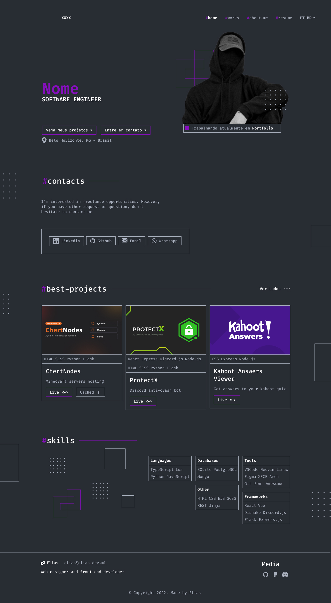
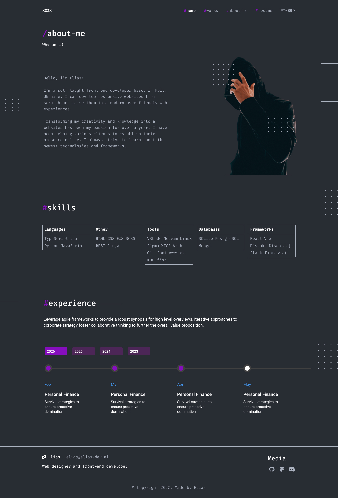
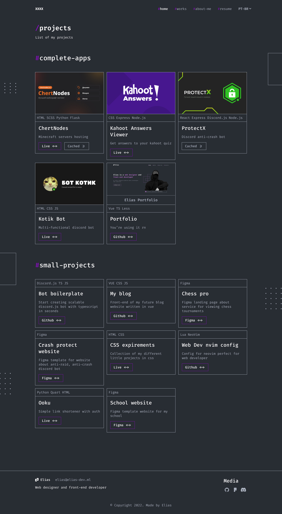
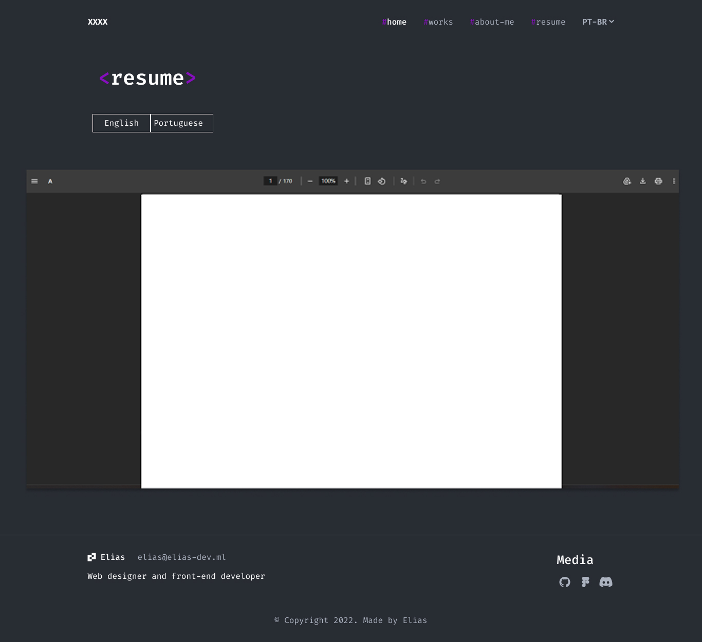

# Portfólio Profissional

O objetivo deste projeto consiste na construção de um website de portfólio profissional, criado com React para apresentar minha trajetória, habilidades, projetos, experiências e contatos de forma moderna e acessível.

## Objetivo

Construir um site pessoal com navegacao clara e conteudo organizado, incluindo apresentacao em PT/EN, projetos em linha do tempo, experiências e canais de contato.

## ✨Principais Funcionalidades

- Menu de navegação estruturado com as seções: Sobre Mim, Projetos, Currículo, Experiências e Contato.
- Seção Sobre Mim bilíngue, com conteúdos disponíveis em português e inglês.
- Listagem de Projetos em ordem cronológica (do mais antigo ao mais recente), contendo tecnologias utilizadas, link para o repositório e mídia ilustrativa.
- Seção com currículo disponível para exportação em português e inglês.
- Seção de Experiências profissionais e acadêmicas, com período de atuação e descrição detalhada das atividades.
- Canal de contato interativo, com redirecionamento para redes profissionais e formulário funcional para envio de mensagens via e-mail.
- Design responsivo e adaptável, garantindo consistência visual e usabilidade em diferentes dispositivos e tamanhos de tela.

## 🛠️ Tecnologias Utilizadas

- **React**: Biblioteca JavaScript para desenvolvimento de interfaces interativas e reutilizáveis.
- **Tailwind**: Framework CSS utilitário para estilização rápida e responsiva.
- **Vite**: Build tool utilizada para desenvolvimento local e geração do build de produção.
-  Definir servico de envio de e-mail (EmailJS, Formspree, etc.)

## 📦 Dependências

- react-router-dom – Permite criar navegação entre páginas sem recarregar o navegador

- react-dom – Responsável por fazer a ligação entre o React e o DOM do navegador

- i18next – Biblioteca principal para internacionalização (i18n), responsável por gerenciar traduções e múltiplos idiomas na aplicação.

- react-i18next – Integração do i18next com React, permitindo utilizar hooks e componentes para tradução dentro da interface.

- react-icons – Importação de icons personalizados

- @emailjs/browser – Criação do envio de email

## 📂 Estrutura de pastas

```
/
   docs/
      prototipos/
   frontend/
      public/
      src/
         assets/
         components/
         locales/
         pages/
         services/
         styles/
         App.jsx
         main.jsx
      package.json
      vite.config.js
   README.md
```

> Estrutura atualizada conforme o repositório.

## 🔧 Instalação e Execução

### Pré-requisitos
Certifique-se de que o usuário tenha o ambiente configurado.

- Node.js LTS (Necessário para o Front-end React)
- Gerenciador de pacotes: npm (ou yarn/pnpm)

### Passos

1. Acesse a pasta do front-end:
   - cd frontend
2. Instale as dependências:
   - npm install
3. Execute em modo de desenvolvimento:
   - npm run dev
4. Gere o build de produção:
   - npm run build
5. Visualize o build localmente (opcional):
   - npm run preview

> Comandos atualizados conforme os scripts reais do projeto.

## Configuração do formulário de contato

- documentar o servico de envio de e-mail e as variaveis de ambiente necessarias.

## ⚡Como Executar a Aplicação

Execute a aplicação em modo de desenvolvimento em dois terminais separados.

Passo a passo de execução aqui.

## Deploy

- Provedor: a definir
- URL publica: a definir

## Figma

- https://www.figma.com/design/2n2ZNTDzwCOiKLBwfiv7Ir/Portfolio?node-id=0-1&t=ZzlhBkS4CiMu8oKJ-1

## 🖼️ Prints do Protótipo

### Home


### About


### Projects


### Resume


  
## 👥 Autores

- Ana Luiza de Freitas Rodrigues
- Felipe Augusto Mendes Pereira
- Francisco Rafael Pereira Rodrigues
- Kayke Emanoel de Souza Santos

## Professor responsável

- João Paulo Carneiro Aramuni

## Licença

- definir licenca do projeto.
